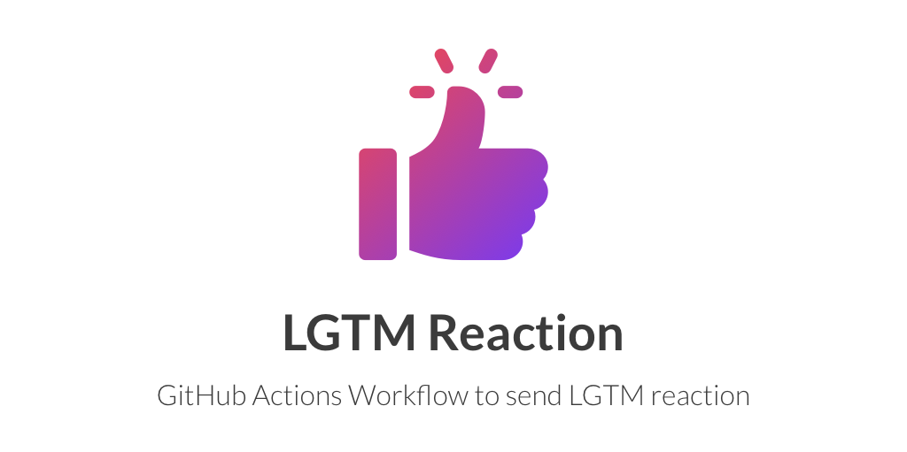

[](https://github.com/micnncim/action-lgtm-reaction/actions)
[](https://github.com/micnncim/action-lgtm-reaction/releases)
[](https://github.com/marketplace/actions/lgtm-reaction)


Send LGTM reaction as image or GIF when we say `lgtm`.  

Currently supports [LGTM.app](https://www.lgtm.app) and [GIPHY](https://giphy.com).

## Usage

### Create Workflow

#### `jobs.<job_id>.steps.env`

|       Key       |             Value              |                        Required                        |
| --------------- | ------------------------------ | ------------------------------------------------------ |
| `GITHUB_TOKEN`  | `${{ secrets.GITHUB_TOKEN }}`  | `true`                                                 |
| `GIPHY_API_KEY` | `${{ secrets.GIPHY_API_KEY }}` | `true` if `jobs.<job_id>.steps.with.source` == `giphy` |

#### `jobs.<job_id>.steps.with`

|    Key     |               Default                | Required |                             Note                              |
| ---------- | ------------------------------------ | -------- | ------------------------------------------------------------- |
| `trigger`  | `'["^lgtm$", "^[gG]ood [jJ]ob!?$"]'` | `false`  | Trigger comment body. It must be JSON string array of regexp. |
| `override` | `false`                              | `false`  | Override posted comment body or not.                          |
| `source`   | `lgtmapp`                            | `false`  | `lgtmapp` or `giphy`                                          |

#### Example

For minimalists:

```yaml
name: Send LGTM reaction
on:
  issue_comment:
    types: [created]
  pull_request_review:
    types: [submitted]
jobs:
  build:
    runs-on: ubuntu-latest
    steps:
      - uses: actions/checkout@1.0.0
      - uses: micnncim/action-lgtm-reaction@
        env:
          GITHUB_TOKEN: ${{ secrets.GITHUB_TOKEN }}
```

For nerds:

```yaml
name: Send LGTM reaction
on:
  issue_comment:
    types: [created]
  pull_request_review:
    types: [submitted]
jobs:
  build:
    runs-on: ubuntu-latest
    steps:
      - uses: actions/checkout@1.0.0
      - uses: micnncim/action-lgtm-reaction@latest
        env:
          GITHUB_TOKEN: ${{ secrets.GITHUB_TOKEN }}
          GIPHY_API_KEY: ${{ secrets.GIPHY_API_KEY }}
        with:
          trigger: '[".*looks good to me.*"]'
          override: true
          source: 'giphy'
```

## Projects using `action-lgtm-reaction`

- [Cake Website](https://github.com/cake-build/website)

## Note

*Icon made by Freepik from [www.flaticon.com](https://www.flaticon.com)*

## License

[MIT License](LICENSE)
