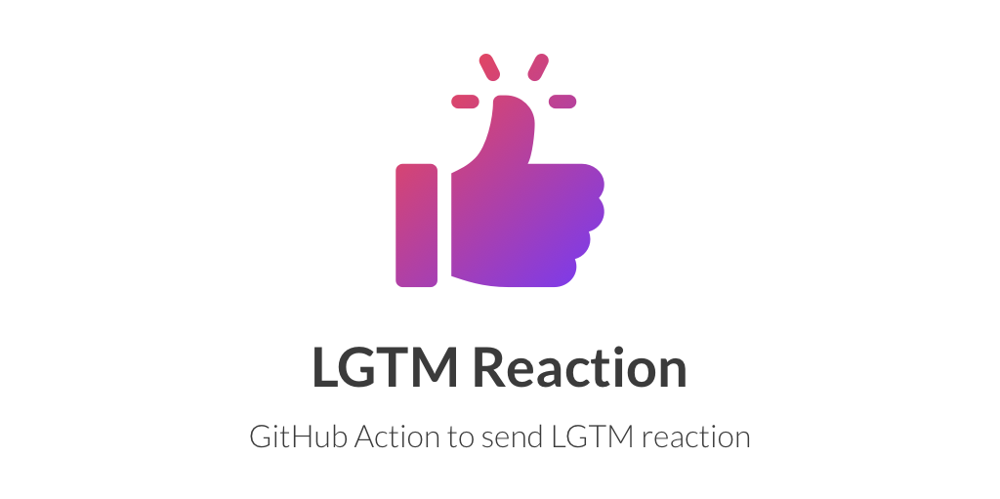

[![actions-workflow-CI][actions-workflow-CI-badge]][actions-workflow-CI]
[![actions-marketplace][actions-marketplace-badge]][actions-marketplace]
[![pkg.go.dev][pkg.go.dev-badge]][pkg.go.dev] 
[![release][release-badge]][release]
[![license][license-badge]][license] 


Send LGTM reaction as image when we say `lgtm`.

Currently supports [LGTM.app](https://www.lgtm.app) and [GIPHY](https://giphy.com).

## Usage

### Create Workflow

#### `jobs.<job_id>.steps.env`

|       Key       |             Value              |                        Required                        |
| --------------- | ------------------------------ | ------------------------------------------------------ |
| `GITHUB_TOKEN`  | `${{ secrets.GITHUB_TOKEN }}`  | `true`                                                 |
| `GIPHY_API_KEY` | `${{ secrets.GIPHY_API_KEY }}` | `true` if `jobs.<job_id>.steps.with.source` == `giphy` |

#### `jobs.<job_id>.steps.with`

|    Key     |               Default                | Required |                             Note                              |
| ---------- | ------------------------------------ | -------- | ------------------------------------------------------------- |
| `trigger`  | `'["^lgtm$", "^[gG]ood [jJ]ob!?$"]'` | `false`  | Trigger comment body. It must be JSON string array of regexp. |
| `override` | `false`                              | `false`  | Override posted comment body or not.                          |
| `source`   | `lgtmapp`                            | `false`  | `lgtmapp` or `giphy`                                          |

#### Example

For minimalists:

```yaml
name: Send LGTM reaction
on:
  issue_comment:
    types: [created]
  pull_request_review:
    types: [submitted]
jobs:
  build:
    runs-on: ubuntu-latest
    steps:
      - uses: actions/checkout@1.0.0
      - uses: micnncim/action-lgtm-reaction@master
        env:
          GITHUB_TOKEN: ${{ secrets.GITHUB_TOKEN }}
```

For nerds:

```yaml
name: Send LGTM reaction
on:
  issue_comment:
    types: [created]
  pull_request_review:
    types: [submitted]
jobs:
  build:
    runs-on: ubuntu-latest
    steps:
      - uses: actions/checkout@v2
      - uses: micnncim/action-lgtm-reaction@master # Set some version.
        env:
          GITHUB_TOKEN: ${{ secrets.GITHUB_TOKEN }}
          GIPHY_API_KEY: ${{ secrets.GIPHY_API_KEY }}
        with:
          trigger: '[".*looks good to me.*"]'
          override: true
          source: 'giphy'
```

### Setting GIPHY

The default image source is [LGTM.app](https://www.lgtm.app) but you can also configure [GIPHY](https://giphy.com).

1. Create your app and get API key from [here](https://developers.giphy.com/dashboard).
2. Set the API key in GitHub repository (Setting > Secret) as `GIPHY_API_KEY`.
3. Configure `'giphy'` in your GitHub Actions workflow.

## Projects using `action-lgtm-reaction`

- [Cake Website](https://github.com/cake-build/website)

## Note

*Icon made by Freepik from [www.flaticon.com](https://www.flaticon.com)*

<!-- badge links -->

[actions-workflow-CI]: https://github.com/micnncim/action-lgtm-reaction/actions?query=workflow%3ACI
[actions-workflow-CI-badge]: https://img.shields.io/github/workflow/status/micnncim/action-lgtm-reaction/CI?label=CI&style=for-the-badge&logo=github

[actions-marketplace]: https://github.com/marketplace/actions/lgtm-reaction
[actions-marketplace-badge]: https://img.shields.io/badge/marketplace-lgtm%20reaction-blue?style=for-the-badge&logo=github

[pkg.go.dev]: https://pkg.go.dev/github.com/micnncim/action-lgtm-reaction?tab=overview
[pkg.go.dev-badge]: https://img.shields.io/badge/pkg.go.dev-reference-02ABD7?style=for-the-badge&logoWidth=25&logo=data%3Aimage%2Fsvg%2Bxml%3Bbase64%2CPHN2ZyB4bWxucz0iaHR0cDovL3d3dy53My5vcmcvMjAwMC9zdmciIHZpZXdCb3g9Ijg1IDU1IDEyMCAxMjAiPjxwYXRoIGZpbGw9IiMwMEFERDgiIGQ9Ik00MC4yIDEwMS4xYy0uNCAwLS41LS4yLS4zLS41bDIuMS0yLjdjLjItLjMuNy0uNSAxLjEtLjVoMzUuN2MuNCAwIC41LjMuMy42bC0xLjcgMi42Yy0uMi4zLS43LjYtMSAuNmwtMzYuMi0uMXptLTE1LjEgOS4yYy0uNCAwLS41LS4yLS4zLS41bDIuMS0yLjdjLjItLjMuNy0uNSAxLjEtLjVoNDUuNmMuNCAwIC42LjMuNS42bC0uOCAyLjRjLS4xLjQtLjUuNi0uOS42bC00Ny4zLjF6bTI0LjIgOS4yYy0uNCAwLS41LS4zLS4zLS42bDEuNC0yLjVjLjItLjMuNi0uNiAxLS42aDIwYy40IDAgLjYuMy42LjdsLS4yIDIuNGMwIC40LS40LjctLjcuN2wtMjEuOC0uMXptMTAzLjgtMjAuMmMtNi4zIDEuNi0xMC42IDIuOC0xNi44IDQuNC0xLjUuNC0xLjYuNS0yLjktMS0xLjUtMS43LTIuNi0yLjgtNC43LTMuOC02LjMtMy4xLTEyLjQtMi4yLTE4LjEgMS41LTYuOCA0LjQtMTAuMyAxMC45LTEwLjIgMTkgLjEgOCA1LjYgMTQuNiAxMy41IDE1LjcgNi44LjkgMTIuNS0xLjUgMTctNi42LjktMS4xIDEuNy0yLjMgMi43LTMuN2gtMTkuM2MtMi4xIDAtMi42LTEuMy0xLjktMyAxLjMtMy4xIDMuNy04LjMgNS4xLTEwLjkuMy0uNiAxLTEuNiAyLjUtMS42aDM2LjRjLS4yIDIuNy0uMiA1LjQtLjYgOC4xLTEuMSA3LjItMy44IDEzLjgtOC4yIDE5LjYtNy4yIDkuNS0xNi42IDE1LjQtMjguNSAxNy05LjggMS4zLTE4LjktLjYtMjYuOS02LjYtNy40LTUuNi0xMS42LTEzLTEyLjctMjIuMi0xLjMtMTAuOSAxLjktMjAuNyA4LjUtMjkuMyA3LjEtOS4zIDE2LjUtMTUuMiAyOC0xNy4zIDkuNC0xLjcgMTguNC0uNiAyNi41IDQuOSA1LjMgMy41IDkuMSA4LjMgMTEuNiAxNC4xLjYuOS4yIDEuNC0xIDEuN3oiLz48cGF0aCBmaWxsPSIjMDBBREQ4IiBkPSJNMTg2LjIgMTU0LjZjLTkuMS0uMi0xNy40LTIuOC0yNC40LTguOC01LjktNS4xLTkuNi0xMS42LTEwLjgtMTkuMy0xLjgtMTEuMyAxLjMtMjEuMyA4LjEtMzAuMiA3LjMtOS42IDE2LjEtMTQuNiAyOC0xNi43IDEwLjItMS44IDE5LjgtLjggMjguNSA1LjEgNy45IDUuNCAxMi44IDEyLjcgMTQuMSAyMi4zIDEuNyAxMy41LTIuMiAyNC41LTExLjUgMzMuOS02LjYgNi43LTE0LjcgMTAuOS0yNCAxMi44LTIuNy41LTUuNC42LTggLjl6bTIzLjgtNDAuNGMtLjEtMS4zLS4xLTIuMy0uMy0zLjMtMS44LTkuOS0xMC45LTE1LjUtMjAuNC0xMy4zLTkuMyAyLjEtMTUuMyA4LTE3LjUgMTcuNC0xLjggNy44IDIgMTUuNyA5LjIgMTguOSA1LjUgMi40IDExIDIuMSAxNi4zLS42IDcuOS00LjEgMTIuMi0xMC41IDEyLjctMTkuMXoiLz48L3N2Zz4=

[release]: https://github.com/micnncim/action-lgtm-reaction/releases
[release-badge]: https://img.shields.io/github/v/release/micnncim/action-lgtm-reaction?style=for-the-badge&logo=github

[license]: LICENSE
[license-badge]: https://img.shields.io/github/license/micnncim/action-lgtm-reaction?style=for-the-badge

